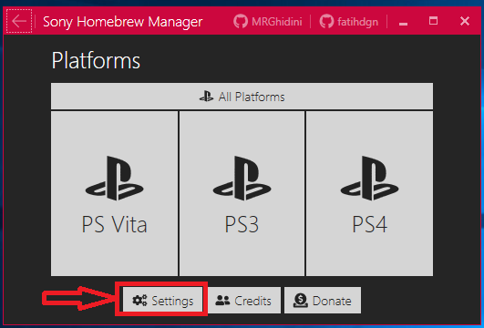
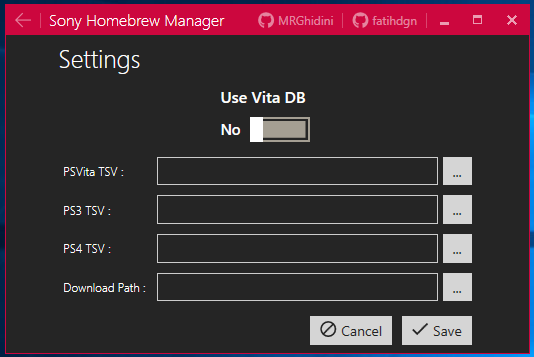
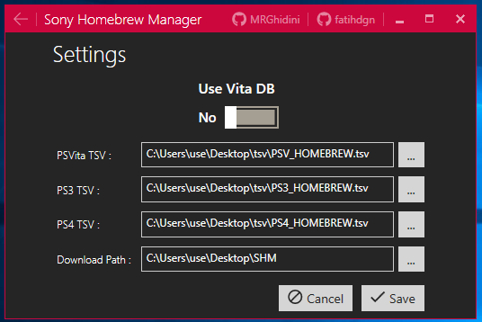
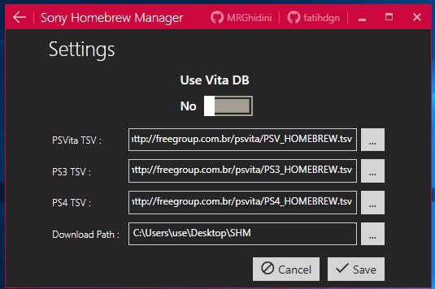
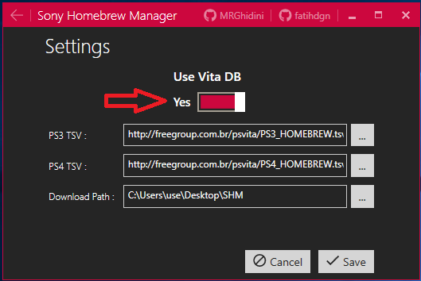
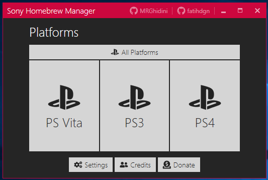
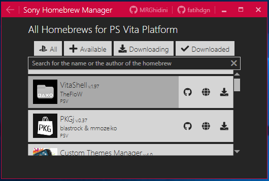
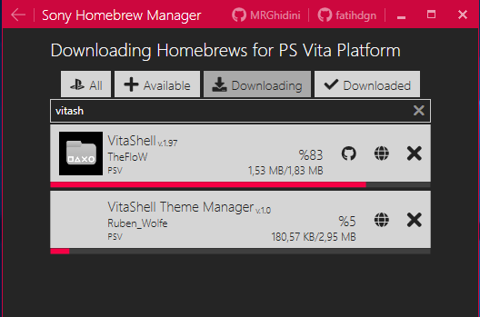
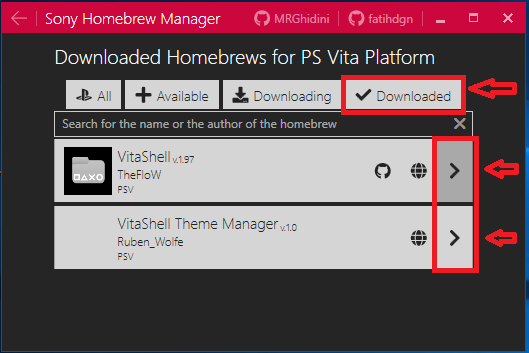

# SHM
Sony Homebrew Manager

It is a homebrew manager for Psvita / PS3 / PS4 that can read tsv files on your computer or via hospetado link on some server, listing the homebrews, doing the download control.
And for homebrews of psvita has the ability to integrate with site vitadb (http://vitadb.rinnegatamante.it/#/)

# Requirements for use

Operational system:
Windows 7 (32bits / 64bits), Windows 8 (32bits / 64bits), Windows 10 (32bits / 64bits) and UP

Taget Framework:
.NET Framework 4.6.1 - Minimum required

# Initial setting

1 - Download the latest version here [Download last version](https://github.com/MRGhidini/SHM/releases/latest)

2 - Run SHM.UI.exe and select > Setting

3 - Now configure the paths below, remembering that where you request tsv files you can point to website link instead of pointing to the physical file (To help with this task, I left 3 sample files in the tsv folder use as an example).

Example of physical file

Example of files through website

And for option of Psvita you can integrate with the option vitadb (rinnegatamante) for Psvita, to use just check the option below. (Communication with vitadb is json rest)

# How to use

1 - Choose one of the options below for Psvita / PS3 / PS4 or All Platforms

2 - It will display a list with all the homebrews, and based on the selection it is possible to access other information and even videos.

3 - After selecting your homebrew, press Download that SHM will start download your homebrew and you can do multiple download at the same time

4 - After the download press the "Downloaded" button and it will display a list of all downloaded homebrews.

5 - Recommendations for use in "Settings"
* For Psvita option, activate the option Vita db, go get every list of homebrews of the site rinnegatamante
* For PS3 option use the link "http://freegroup.com.br/psvita/PS3_HOMEBREW.tsv" because it will always be updated
* For PS4 option use the link "http://freegroup.com.br/psvita/PS4_HOMEBREW.tsv" because it will always be updated

# Compile the source

Copy all SHM folders to your PC and use visual studio 2017

## Special thanks  
- Faith Doğan For all the learning you've given me and all the time spent helping me and improving the project. Many thanks ^^ 
- Nukasnel for test
- Berg for test
- GamersRebirthDL thanks for all your publications and your collaboration for test
- rinnegatamante for the communication via rest json do vitadb
- theheroGAC Thank you for updating the list of homebrews
