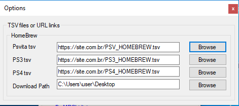

# SHM
Sony Homebrew Manager

It is a manager of homebrews for Psvita / PS3 / PS4 that can read tsv files on your computer or via hospetado link on some server, listing the homebrews, doing the control of download.

# Requirements for use

Operational system:
Windows 7 (32bits / 64bits), Windows 8 (32bits / 64bits), Windows 10 (32bits / 64bits) and UP

Taget Framework:
.NET Framework 4.6.1 - Minimum required

# Initial setting

1 - Download the latest version here [Download last version](https://github.com/MRGhidini/SHM/releases/latest)

2 - Run SHM.exe and select any option, note that SHM will send a warning and will close  happens only the first time it runs on your pc, this process is necessary for SHM to create the configuration settings.

3 - Run SHM.exe and select Menu > Setting

4 - Now configure the paths below, remembering that where you request tsv files you can point to website link instead of pointing to the physical file (To help with this task, I left 3 sample files in the tsv folder use as an example).

Example of physical file

Example of files through website

For version 1.1 and higher you can integrate with the option vitadb (rinnegatamante) for Psvita, to use just check the option below. (Communication with vitadb is rest json)

# How to use

1 - Choose one of the options below for Psvita / PS3 / PS4

2 - It will display a list with all the homebrews, and based on the selection it is possible to access other information and even videos.

3 - After selecting your homebrew, press Download that SHM will start the downlaod of your homebrew

4 - After download realize that by clicking on the list of homebrews again, SHM marked the homebrew that you downloaded highlighting with a color, and so it will control and save your history of download in file historic.txt

# Compile the source

Copy the entire SHM folder to your pc and use Visual Studio 2017

## Special thanks  
- Nukasnel for test
- Berg for test
